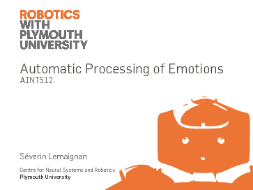

Emotion modelling and classification
====================================

Lecture slides on emotions modelling and classification. This lecture cover in
particular the creation (from scratch) of a working emotion classifier in
Python.
Covers topics like the circumplex model of emotions, the PAD model, action
units, comparison of PCA/LDA + SVM/kNN for emotion recognition, the generation
of emotions by robots, anthorpomorphism.

- **Target audience**: MSc students
- **License**: CC-BY-SA (ie, you can freely reuse this material, as long as you clearly mention Séverin Lemaignan as the original author. If you modify/augment
these slides, you *must* share the modifications under the same license)
- [Link to the PDF slides](emotions.pdf)

*I recommend [pdfpc](https://github.com/pdfpc/pdfpc) to present these slides: a
great PDF presentation tool, with support for embedded videos.*
